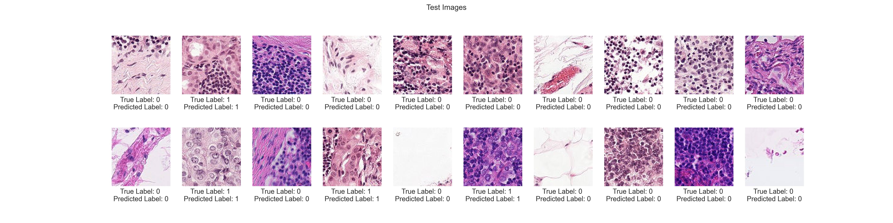

# histopathology-cancer-detection
In this project, we tackled the problem of classifying cancer in histopathologic scans of lymph node sections, based on a kaggle challenge<sup>1</sup>. Check out `demo.ipynb` for quick a demonstration.



-----------------------------------------------------------------------------------------------------------------------
## Project Structure
### Root-Folder:
|File/Folder               |Description|
|---|---|
|`dataset.py`|Contains the custom dataset class.|
|`data_loading.py`|Loads the data from the dataset class to create training and test set. Transforms the data according to project specifications.|
|`train.py`|Creates and trains a model using command line arguments.|
|`test.py`|Loads a trained model and evaluates on the test set using command line arguments.|
|`main.py`|Combination of `train.py` and `test.py`. First creates a model, then evaluates it.|
|`requirements.txt`|Lists all packages used for the project. Designed to be used with pip.|
|`architecture`|Folder containing all the models that can be used.|
|`final_model.pth`|Best model. Can be loaded with pytorch.|
|`demo.ipynb`|A python notebook demonstrating the classification process with examples.|
|`Hyperparameter_tuning`|Folder containing a modified main and train file used for Hyperparameter Tuning, aswell as models that were trained using Hyperparameter Tuning|

### Available Models:

|Name             |Description|
|---|---|
|`cnn_1.py`|A simple CNN, referenced in the paper as "Baseline CNN"|
|`cnn_2.py`|An extension of the simple CNN, referenced in the paper as "Extended CNN"|
|`resnet18.py`|ResNet18, using the pytorch implementation|
|`densenet121.py`|DenseNet101, using the pytorch implementation|
|`mlp_mixer.py`|A custom implementation of the MLP-Mixer architecture proposed by Google <sup>2</sup>,<sup>3</sup>. |

-----------------------------------------------------------------------------------------------------------------------
## Install

### Dependencies:
- Python 3.10.6
- requirements.txt

### Instructions:
- clone histopathology-cancer-detection
- cd into histopathology-cancer-detection
- create and activate a custom python virtual environment
- install packages from requirements.txt
```bash
$ python -m pip install -r requirements.txt
```
- create a folder `data` in the root folder, having the following structure:

```
histopathology-cancer-detection
└───data
│   │   sample_submissions.csv
│   │   train_labels.csv
│   │
│   └───train
│   |   │   0000d563d5cfafc4e68acb7c9829258a298d9b6a.tif
│   |   │   0000da768d06b879e5754c43e2298ce48726f722.tif
│   |   │   ...
│   │   |
|   └───test
│   |   │   0000ec92553fda4ce39889f9226ace43cae3364e.tif
│   |   │   000c8db3e09f1c0f3652117cf84d78aae100e5a7.tif
│   |   │   ...
```

-----------------------------------------------------------------------------------------------------------------------
## Usage

### Command line arguments for specific files


|Name             |Description|Required|Available for Files|
|---|---|---|---|
|`--name`|How the output files will be named.|Yes|`train.py`, `test.py`, `main.py`|
|`--model_name`|Which model to be used for training. Can be one of the following: `cnn_1`, `cnn_2`, `resnet18`, `densenet121`, `mlp_mixer`. Corrensponds to the file names in `architecture`.|Yes|`train.py`, `test.py`, `main.py`|
|`--lr`|Determine the learning rate. Default is 0.001.|No|`train.py`, `main.py`|
|`--epochs`|Determine the number of epochs. Default is 10.|No|`train.py`, `main.py`|

Example:

```bash
$ python .\train.py --name baseline_cnn --model_name cnn_1 --lr 0.003 --epochs 5
```

### Artefacts

#### `train.py` 
- Csv file containing training metrics and loss function values for all training batches
- PyTorch .pth file containing the state dict of the trained model

#### `test.py` 
- Csv file containing metrics calculated on the test set

#### `main.py`
- Csv file containing training metrics and loss function values for all training batches
- PyTorch .pth file containing the state dict of the trained model
- Csv file containing metrics calculated on the test set


-----------------------------------------------------------------------------------------------------------------------

<sup>1</sup> https://www.kaggle.com/competitions/histopathologic-cancer-detection/ <br>
<sup>2</sup> https://arxiv.org/pdf/2105.01601.pdf <br>
<sup>3</sup> https://github.com/google-research/vision_transformer/blob/linen/vit_jax/models_mixer.py <br>

